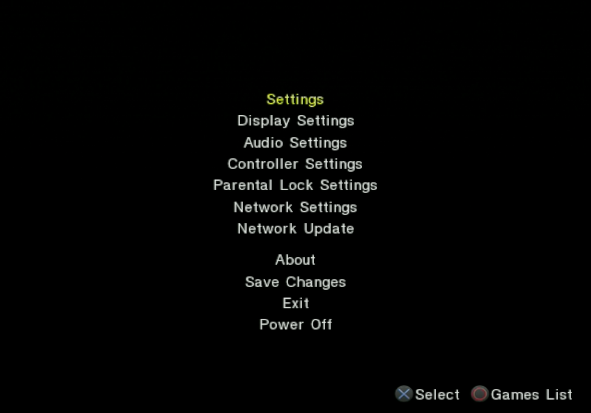
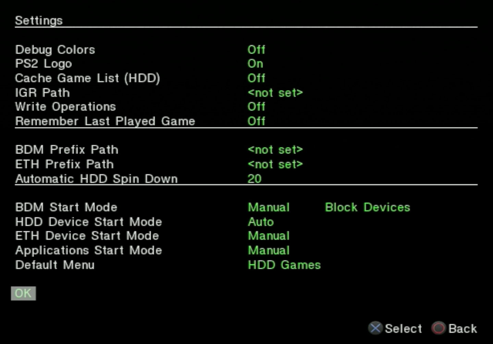
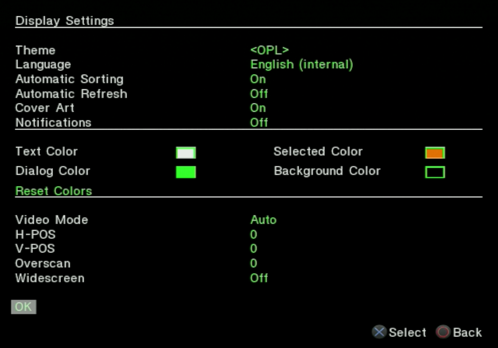
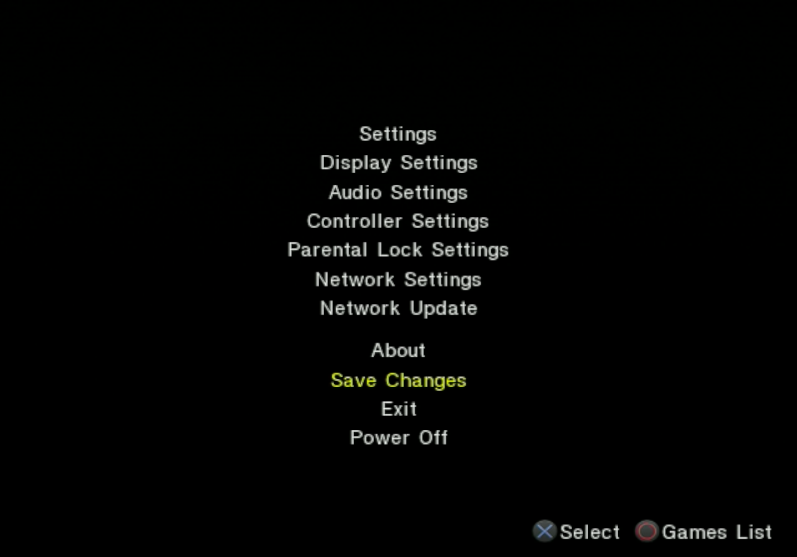
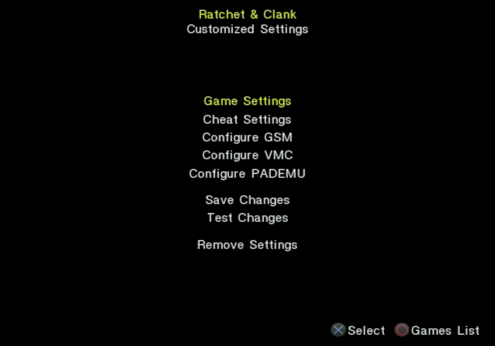
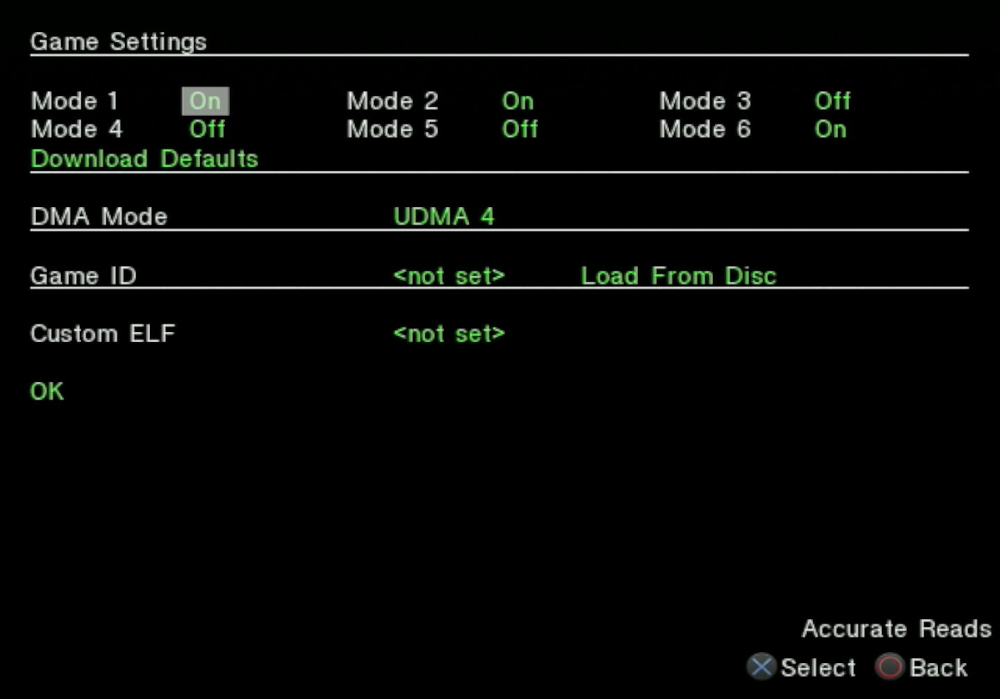
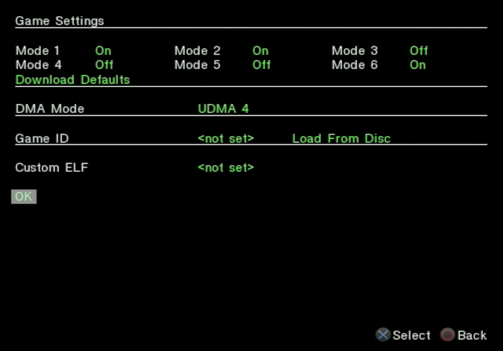
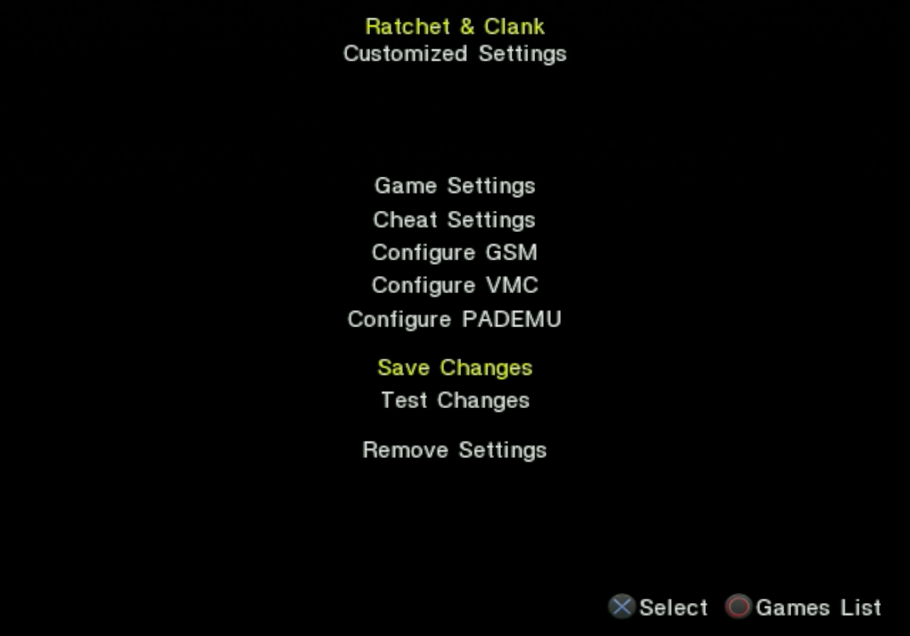

# Setting up and using OPL

OPL documentation across the web is very thorough, so this guide will mainly compile those resources into categories.

!!! warning "PS2-Home forum"

    Many of these guides live on a forum called PS2-Home. You may find that the links will show a 503 error or display an IP ban notification. This does not mean the forum is down, but that your IP has been blocked from accessing the site. You may be able to access the page with a VPN, by using a different internet connection, or on cellular data, but in case none of these options work web archive mirrors of these pages will be provided as well. Be sure to check you are on the latest mirror of these pages.

## OPL setup

### Recommended settings

These instructions will not go into great detail about each setting, but just provide a quickstart overview. Further info can be found in the documentation linked below.

To access the settings menu from OPL, hit the `Start` button.

<figure markdown="span">
    { width="500" }
</figure>

!!! note "Settings vary between OPL versions"

    The below settings may have differing names or might not be available depending on your version of OPL. Adjust any settings that you do have.

### Settings

Select `Settings` from this menu.

Some recommended settings include:

* Disable Debug Colors: `On` / Debug Colors: `Off`
* USB device start mode: `Off` / BDM Start Mode: `Manual | Block Devices`
* HDD device start mode: `Auto` 
* Default menu: `HDD Games` 

<figure markdown="span">
    { width="500" }
</figure>

When finished, select `OK` at the bottom.

### Display settings

Select `Display Settings`.

Some recommended settings include:

* Enable Cover Art: `On` / Cover Art: `On`
* Display info page: `On`

<figure markdown="span">
    { width="500" }
</figure>

When finished, select `OK` at the bottom.

To save all changes, select `Save changes` from the top **Settings** menu.

<figure markdown="span">
    { width="500" }
</figure>

### Documentation

Consult the [PS2-Home: OPL Recommended Settings](https://www.ps2-home.com/forum/app.php/page/opl_recommended_settings) / [Web archive mirror](http://web.archive.org/web/20230521200731/https://www.ps2-home.com/forum/app.php/page/opl_recommended_settings) thread for a thorough explanation of all of the OPL settings and further recommendations.

## Using OPL

### In game reset (IGR)

While playing a game in OPL, `L1+R1+L2+R2+Start+Select` will activate in game reset (IGR) and return to the PS2 memory card menu. However IGR will not work in all games and may cause them to get stuck in a black screen. Consult a compatibility list for any warnings about IGR usage.

!!! warning "IGR path"

    OPL has an option to set a path for the IGR function to boot into instead of the memory card menu. While it is possible to set this path to point to the OPL elf file to return directly to the OPL menu, this may not clear OPL's VMC handshake and could potentially cause difficult to diagnose errors. The PS2-Home guide recommends leaving this at default and re-opening OPL manually to avoid issues.

## OPL compatibility

While OPL with an internal hard drive has a very high game compatibility rate, some games may still encounter issues or bugs with default settings. Before installing game backups, be sure to consult OPL compatibility guides for any warnings or notes. If a game crashes, encounters black screens, or behaves weirdly, try the following steps.

### Compatibility lists

These lists were taken from [jolek's OPL Game Compatibility Lists thread](https://www.psx-place.com/threads/open-ps2-loader-game-compatibility-lists.19037/) with broken or obsolete links removed.

!!! info "Check HDD compatibility"

    Some of these lists may list compatibility for other storage options such as USB hard drives, SMB, or MX4SIO. Ensure that the compatibility notes are specific to playing game backups on an internal HDD. Additionally, keep in mind some notes might have only been tested on SATA or IDE drives.

- [Algol's OPL Game Compatibility List](https://docs.google.com/spreadsheets/d/1K7szQS_9VG8es22eORw3xXTXxp5bZRpHOL6YJDH7S6c/edit?gid=971129131#gid=971129131)
- [OPL-CL](http://sx.sytes.net/oplcl/games.aspx)
- [Compatibility List OPL ZSO](https://docs.google.com/spreadsheets/d/1K7szQS_9VG8es22eORw3xXTXxp5bZRpHOL6YJDH7S6c/edit?gid=971129131#gid=971129131)
- [PS2-Home OPL Game Compatibility List](https://www.ps2-home.com/forum/page/opl-game-compatibility-list) / [Web archive mirror](https://web.archive.org/web/20240612122448/https://www.ps2-home.com/forum/page/opl-game-compatibility-list)

### Compatibility modes

Certain games may not work with OPL's default settings. To fix certain edge cases, OPL allows some of these settings, called **compatibility modes**, to be enabled or disabled per game.

To access these, highlight the game and hit triangle to enter the game's **Customized Settings** screen. Select `Game Settings`.

<figure markdown="span">
    { width="500" }
</figure>

Under the **Game Settings** heading, each of the modes will display an `On`/`Off` status. Highlighting a mode will display a short function label in the bottom right corner. To toggle the mode status, press X.

<figure markdown="span">
    { width="500" }
</figure>

These compatibility modes can toggled in any combination, but some settings are intended to work in conjunction (such as 3 and 6). Consult the compatibility modes guide for more detailed information.

After adjusting settings, select `OK` to return to the previous screen.

<figure markdown="span">
    { width="500" }
</figure>

From here, select `Save Changes`.

<figure markdown="span">
    { width="500" }
</figure>

After the changes have been saved, you can boot directly into the game by selecting `Test Changes`, or to return to the OPL **Game List** by pressing circle.

A breakdown of OPL's compatibility modes can be found here: [PS2-Home: OPL Compatibility modes](https://www.ps2-home.com/forum/app.php/page/opl_modes) / [Web archive mirror](http://web.archive.org/web/20230929004713/https://www.ps2-home.com/forum/app.php/page/opl_modes).

### OPL versions

If the compatibility modes don't fix the issue, you may want to try updating your version of OPL or go back to a stable release.

Check the [OPL releases page](https://github.com/ps2homebrew/Open-PS2-Loader/releases) for release options.

Follow [this guide](../install-OPL/) to update OPL.

### Skip FMCB splash screen

Some games will encounter an issue related to the FMCB splash screen, causing them to get stuck on a black screen. To skip the FMCB splash screen, hold R1 while booting up the PS2. Navigate the file browser to boot the OPL elf file directly then select the game.