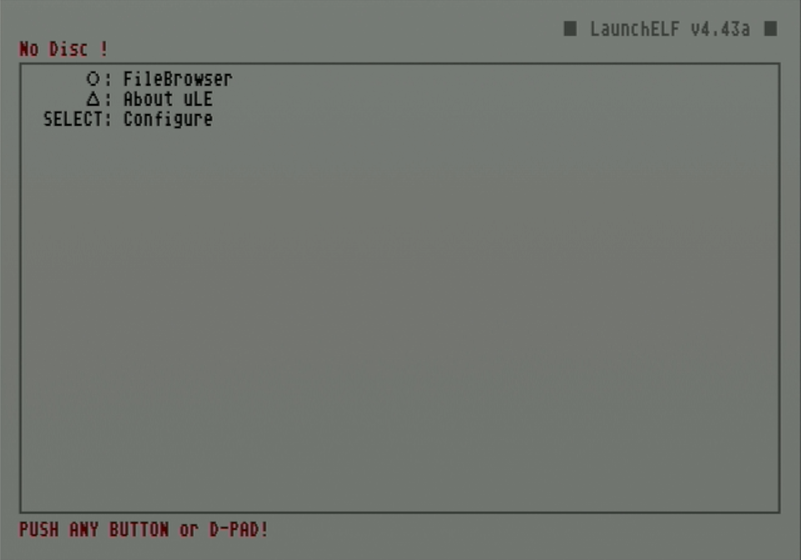
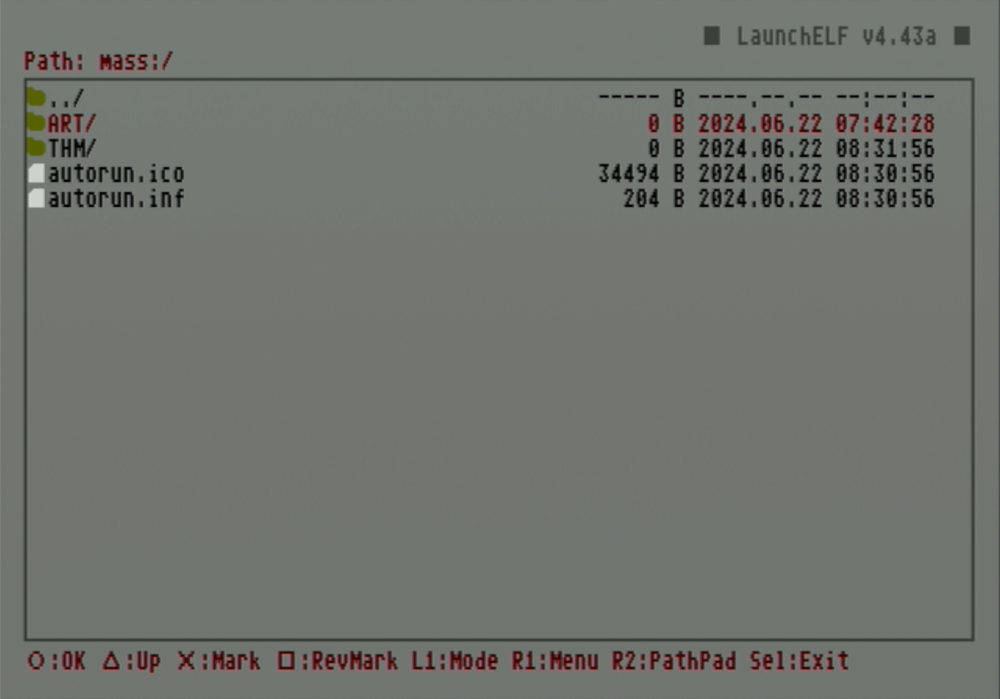
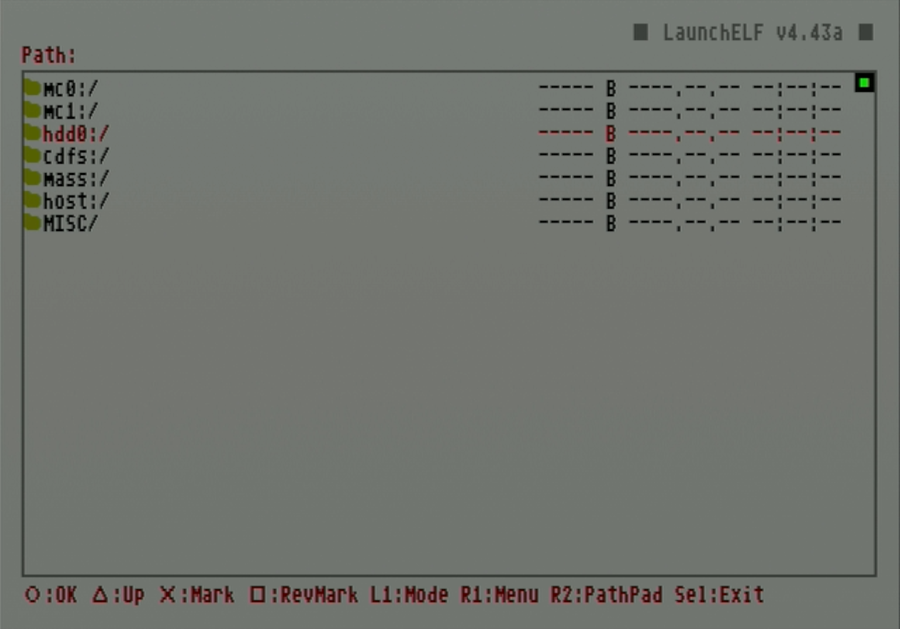

# Add game artwork to OPL

Games will not display artwork by default in OPL. This guide will walk through downloading artwork using OPL Manager and then loading it onto an internal hard drive by mounting it to your PC with HDL Batch Installer or transferring it using a USB drive.

# Download artwork using OPL Manager

## Requirements

* A windows PC
* OPL Manager
* PS2-formatted hard drive with game backups

!!! note "Note: Game list"

    In order for OPL Manager to properly load the game list, game backups must already be installed onto your PS2 hard drive. If not, the tool will typically require correcting titles individually before loading them. If you have not yet loaded game backups onto your hard drive, follow [this guide](../hdl-batch-installer/) first.

## Instructions

1. Connect PS2 HDD to PC.
1. Right click on **OPL Manager** and select `Run as administrator`.
1. Select the PS2 HDD option and point to the HDD.

    <figure markdown="span">
      { width="400" }
    </figure>

1. Load or refresh the game list cache.

    1. On first startup, OPL Manager will display a dialog warning asking to populate the local cache. press `Yes`.

        <figure markdown="span">
        { width="400" }
    </figure>

    2. If not first startup, ensure that any additional games are added to the cache by selecting `Local HDD Options > Get game list`.

        <figure markdown="span">
        { width="400" }
        </figure>

1. Ensure the hard drive is properly connected, then hit `OK`.

    <figure markdown="span">
      { width="400" }
    </figure>

1. When the HDD is detected, OPL Manager will populate the list of titles under the `Home` tab.

    <figure markdown="span">
      { width="500" }
    </figure>

1. Under `Batch Actions` select `ART Download`.

    <figure markdown="span">
      { width="500" }
    </figure>

1. Select all the art options desired and click `Start`. A dialog box will pop up when complete.

    1. Assets will be saved to the art directory in `OPL_Manager/hdl_hdd/ART`.

    <figure markdown="span">
      { width="500" }
    </figure>

# Add artwork to HDD

## Option 1: Directly to HDD

Artwork can be loaded directly onto the HDD

!!! note "Test compatibility"

    This method is faster and more direct but opening PS2 HDD partitions does not work on all computers. Additionally, even if a hard drive can be mounted, some files may encounter errors with copying and require using the USB thumb drive method.

## Requirements

* A Windows PC (see below note)
* HDL Batch Installer

## Instructions

1. Open **HDL Batch Installer**.

2. Click `Search ps2 HDD's` at the top to automatically find the PS2 drive or use the dropdown at the top to select it.

    <figure markdown="span">
      { width="400" }
    </figure>

1. From the lower tabs select `HDD Management`.

    <figure markdown="span">
      { width="400" }
    </figure>

1. Click the `Mount hdd Partition` option.

    1. You may be prompted to install Dokan if it is not installed already. Click the prompt to go to the website to download the installer.
    1. When done installing Dokan, restart HDL Batch Installer before continuing.

    <figure markdown="span">
      { width="400" }
    </figure>

1. Under `Available partitions` select the `+OPL` partition.

    <figure markdown="span">
      { width="500" }
    </figure>

1. Under `Mount point` select a free drive.

    <figure markdown="span">
      { width="500" }
    </figure>

1. Click `Mount` to mount the partition to the selected mount point.

    <figure markdown="span">
      { width="500" }
    </figure>

1. Select `Open in explorer`.

    <figure markdown="span">
      { width="500" }
    </figure>

1. Copy artwork from the OPL Manager art folder located at `OPL_Manager/hdl_hdd/ART` to the +OPL partition `ART/` folder on the hard drive.

    !!! tip "Tip: OPL themes"
    
        Along with game artwork, OPL themes can also be loaded directly to the hard drive using this method. Copy theme folders (which use the naming prefix `thm_`) to the `THM/` directory.

1. When finished, click the `Unmount` button to unmount the drive.

!!! warning "ALWAYS unmount the drive when finished!"

    This will prevent the drive from being corrupted.

## Option 2: Transfer artwork to HDD using USB

If your PC is unable to mount the OPL partition, artwork can be loaded using a USB drive.

## Requirements

* USB thumb drive formatted to FAT32

## Instructions

1. Copy the `ART/` folder to the FAT32 USB drive.

    1. In addition, themes can be loaded and copied by copying `THM/` to the drive as well.

1. Plug both USB and hard drive into PS2.

1. Select `uLaunchELF`.

    <figure markdown="span">
      { width="500" }
    </figure>

1. Press circle to access `FileBrowser`.

    <figure markdown="span">
      { width="500" }
    </figure>

1. Scroll down and use circle to select `mass:/`.

    <figure markdown="span">
      { width="500" }
    </figure>

1. Scroll or dive into your USB drive to highlight the `ART/` directory then click R1 to open the `Menu`.

    <figure markdown="span">
      { width="500" }
    </figure>

1. Press circle to select `Copy`. The upper left status text will change to say `Copied to the Clipboard`.

    <figure markdown="span">
      { width="500" }
    </figure>

1. Press triangle to return to the previous folder. Scroll up to `hdd0:/` and press circle.

    <figure markdown="span">
      { width="500" }
    </figure>

1. Scroll down to `+OPL` and press circle.

    <figure markdown="span">
      { width="500" }
    </figure>

1. Press R1 to open the `Menu` again then press circle to select paste.

    <figure markdown="span">
      { width="500" }
    </figure>

1. A name conflict warning dialog will appear. Press circle to select `OK`.

    <figure markdown="span">
      { width="500" }
    </figure>

1. Once finished, open OPL to confirm the images have been loaded correctly.

!!! tip "Tip: Copying themes"

    "Repeat these last few steps to copy any themes to the OPL directory by pasting over the `THM/` folder."

You are ready to play game backups complete with game artwork or themes for OPL.
