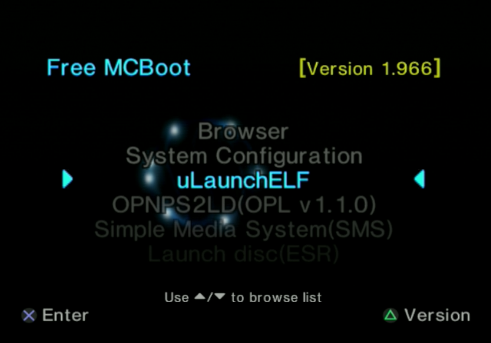
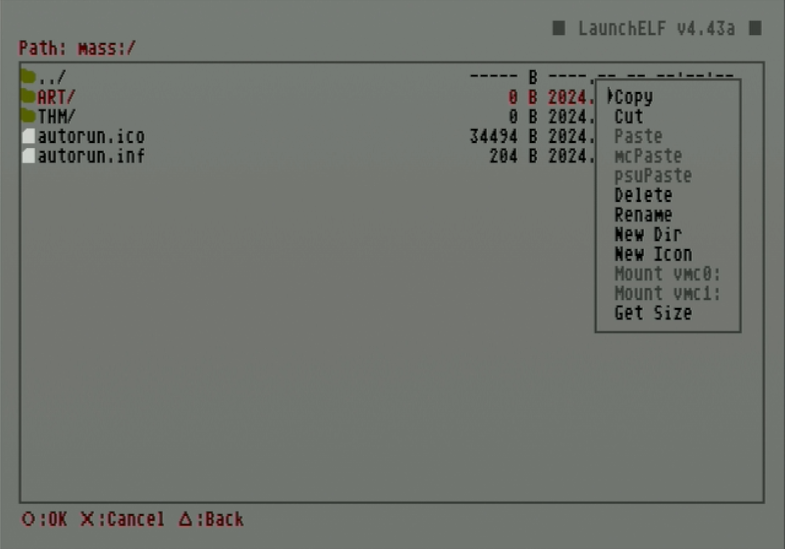
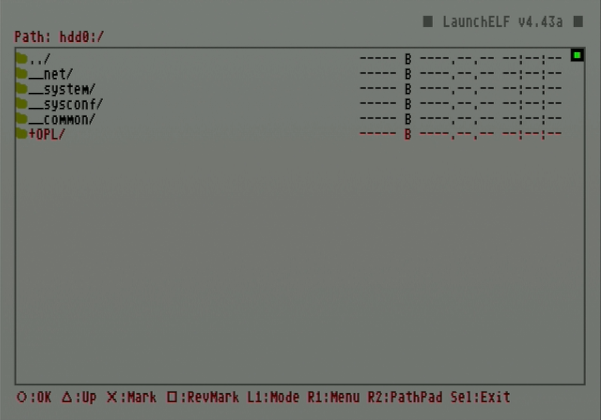
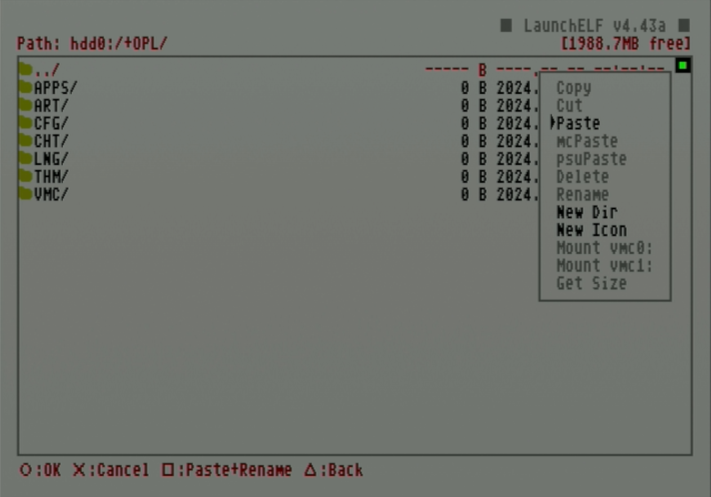
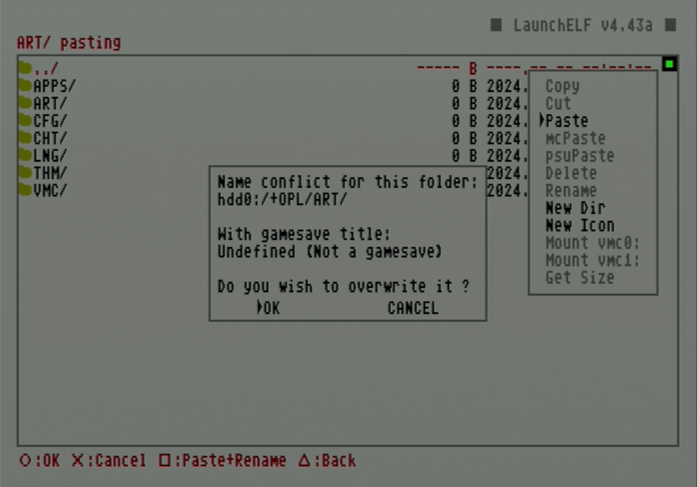

# Add game artwork to HDD

# Download artwork using OPL Manager

## Requirements

* A windows PC
* OPL Manager
* HDD with game backups already loaded on it

## Instructions

1. Connect PS2 HDD to PC.
1. Right click on **OPL Manager** and select `Run as administrator`.
1. Select the PS2 HDD option and point to the HDD.

    

1. On first startup, this will display a dialog warning asking to populate the local cache. press `Yes`.

    

1. If not first startup, ensure that any additional games are added to the cache by TODO

    

1. Ensure the hard drive is properly connected, then hit `OK`.

    

1. When the HDD is detected, OPL Manager will populate the list of titles under the `Home` tab.

    

1. Under `Batch Actions` select `ART Download`.

    

1. Select all the art options desired and click `Start`. A dialog box will pop up when complete.

    1. Assets will be saved to the art directory in `OPL_Manager/hdl_hdd/ART`.

    

# Add artwork to HDD

# Option 1: Directly to HDD

## Requirements

* A Windows PC (see below note)
* HDL Batch Installer

## Instructions

!!! note "Test compatibility"

    This method is faster and more direct but opening PS2 HDD partitions does not work on all computers. Additionally, even if a hard drive can be mounted, some files may encounter errors with copying and require using the USB thumb drive method.

1. Open **HDL Batch Installer**.

2. Click `Search ps2 HDD's` at the top to automatically find the PS2 drive or use the dropdown at the top to select it.

    

1. From the lower tabs select `HDD Management`.

    

1. Click the `Mount hdd Partition` option.

    1. You may be prompted to install Dokan if it is not installed already. Click the prompt to go to the website to download the installer.
    1. When done installing Dokan, restart HDL Batch Installer before continuing.

    

1. Under `Available partitions` select the `+OPL` partition.

    

1. Under `Mount point` select a free drive.

    

1. Click `Mount` to mount the partition to the selected mount point.

    

1. Select `Open in explorer`.

    

1. Copy artwork from the OPL Manager art folder located at `OPL_Manager/hdl_hdd/ART` to the +OPL partition `ART/` folder on the hard drive.

1. When finished, click the `Unmount` button to unmount the drive.

!!! warning "ALWAYS unmount the drive when finished!"

    This will prevent the drive from being corrupted.

# Option 2: Transfer artwork to HDD using USB

If your PC is unable to mount the OPL partition, artwork can be loaded using a USB drive.

## Credits
* This guide follows [
Blaine Locklair's YouTube tutorial](https://www.youtube.com/watch?v=C02j3wTuJag)

## Requirements

* USB thumb drive formatted to FAT32

## Instructions

1. Copy the `ART/` folder to the FAT32 USB drive.

1. Plug both USB and hard drive into PS2.
2. Select `uLaunchELF`.

    

1. Press circle to access `FileBrowser`.

    

1. Scroll down and use circle to select `mass:/`.

    

1. Scroll or dive into your USB drive to highlight the `ART/` directory then click R1 to open the `Menu`.

    

1. Press circle to select `Copy`. The upper left status text will change to say `Copied to the Clipboard`.

    

1. Press triangle to return to the previous folder. Scroll up to `hdd0:/` and press circle.

    

1. Scroll down to `+OPL` and press circle.

    

1. Press R1 to open the `Menu` again then press circle to select paste.

    

1. A name conflict warning dialog will appear. Press circle to select `OK`.

    

1. Once finished, open OPL to confirm the images have been loaded correctly.
