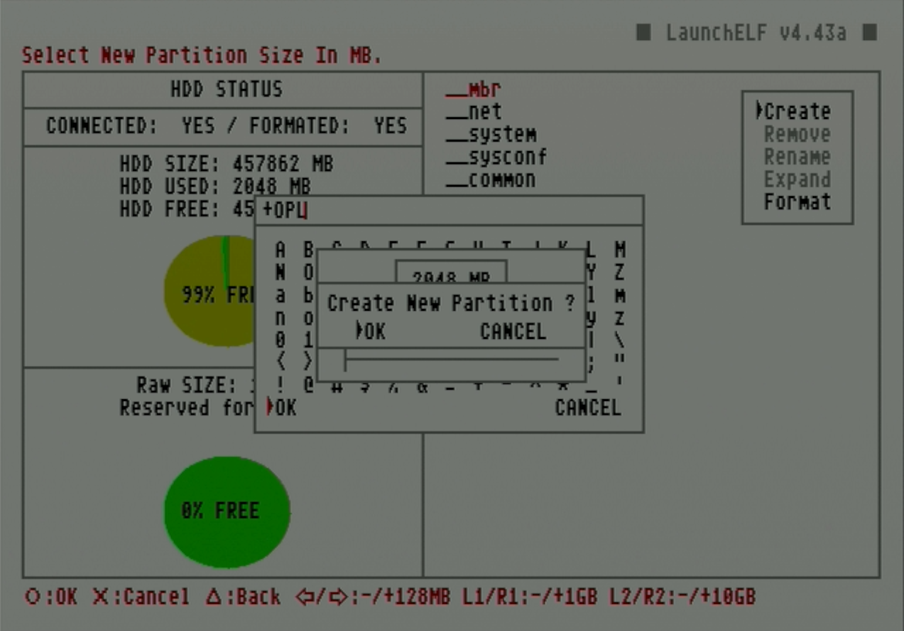

# Format and create partitions on hard drive

This guide will cover how to format and partition a hard drive for usage as an internal drive in a PS2. Both of these steps can be done directly on the PS2 using uLaunchELF/wLaunchELF loaded from a FreeMcBoot card.

!!! warning "Flashing pre-made images to hard drive"

    An alternative to using uLaunchELF to format the drive is to flash a pre-made RAW image typically to install FreeHDBoot or packaged programs using HDD Raw Copy Tool. These disc images are created from drives that may have differing disk geometry from the one you are using, so it is recommended to instead use uLaunchELF to format and create needed partitions.

!!! warning "Formatting with WinHIIP"

    Another alternative to formatting the drive with uLaunchELF is to use WinHIIP. WinHIIP is no longer recommended because it is obsolete, struggles to format drives as large as 2TB, and has bugs that may corrupt drives.

## Credits

- This guide follows [Blaine Locklair's YouTube tutorial](https://www.youtube.com/watch?v=C02j3wTuJag)

## Requirements

* Internal hard drive
* FMCB memory card

## Instructions

### Format hard drive

1. Attach the hard drive to the SATA or IDE connection on the network adapter.

    !!! warning "SATA connectors"

        If you are using a SATA drive, ensure that you have installed an upgrade kit. This [text guide on the console mods wiki](https://consolemods.org/wiki/PS2:SATA_Board_for_LAN_Adapter) walks through the process.

1. Remove the panel labeled `EXPANSION BAY` from the back of the PS2. Slot the network adapter with the attached hard drive into this slot with the connectors. Turn the two large screws on the adapter to attach it firmly.

1. Plug the FMCB card into the memory card slot and boot up the PS2.

1. Launch `uLaunchELF` from the main menu.

    <figure markdown="span">
      { width="500" }
    </figure>

1. In this menu, circle advances and triangle goes back. Press circle to advance to the `FileBrowser`.

    <figure markdown="span">
      { width="500" }
    </figure>

1. Use d-pad to navigate to `MISC/` and press circle to select it.

    <figure markdown="span">
      { width="500" }
    </figure>

1. Navigate to `HddManager` and press circle to select it.

    <figure markdown="span">
      { width="500" }
    </figure>

1. The PS2 HDD Manager screen should show the HDD as connected but not formatted. Press R1 to access the menu.

    <figure markdown="span">
      { width="500" }
    </figure>

1. When the small menu pops up on the right, scroll down and select `Format`.

    <figure markdown="span">
      { width="500" }
    </figure>

1. Press circle to select `OK` on the popup. Once the format is completed, the partition status of the drive will be displayed.

    <figure markdown="span">
      { width="500" }
    </figure>

### Create OPL data partition

1. In these next steps, we will create a partition specifically for OPL data such as artwork and themes. Press R1 to access the `MENU`.

    <figure markdown="span">
      { width="500" }
    </figure>

1. Press circle to select the `Create` option.

    <figure markdown="span">
      { width="500" }
    </figure>

1. Set the name of this partition to `+OPL` then select `OK` .

    <figure markdown="span">
      { width="500" }
    </figure>

1. Set the partition size for the OPL app data.

    1. The recommended partition size depends on the amount of data needed to store OPL-related data such as game artwork, VMCs, and themes. Estimates for standard values range from 512MB to 2048MB, or even 4096MB+ for users planning to load a lot of artwork.

    !!! warning "Expanding the +OPL partition size"

        While the HddManager has the option to expand existing partitions, this has the potential to corrupt the partition. In case the +OPL partition needs to be expanded later, [a batch tool workaround exists](https://www.psx-place.com/threads/wlaunchelf-hddmanager-partition-expanding-test.35704/#post-315273).

    <figure markdown="span">
      { width="500" }
    </figure>

1. Press circle to select `OK`.

    <figure markdown="span">
      { width="500" }
    </figure>

1. Once finished, it will show the created partition. Press triangle to `Exit`.

    <figure markdown="span">
      { width="500" }
    </figure>

!!! warning "Removing an internal hard drive"

    Always ensure the PS2 is properly powered off before removing the internal hard drive.

Once the hard drive has been formatted, game backups can be installed onto it and played through OPL.

Before moving to the next guide, ensure that OPL is installed on your FMCB card. Many pre-made FMCB cards will have apps such as OPL already loaded. However, if OPL isn't installed (or found to be outdated), follow the below optional guide to install or update it first.

[**Next (ONLY if not installed): Install OPL onto FMCB card**](../OPL/) 

If OPL is installed, continue below.

!!! tip "Tip: Generate default OPL folders"

    Before removing the hard drive from the PS2, launch OPL to generate the appropriate subdirectories. This can set up folders ahead of time if you plan to load game artwork or OPL themes directly from PC.

[**Next: Install game backups to hard drive**](../hdl-batch-installer/)