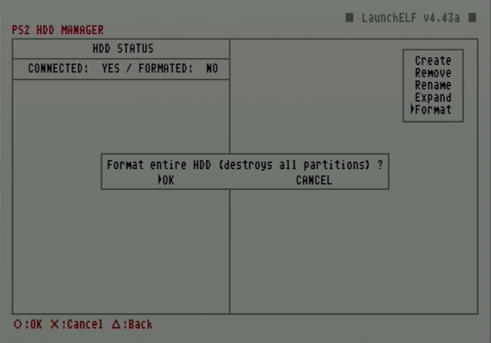
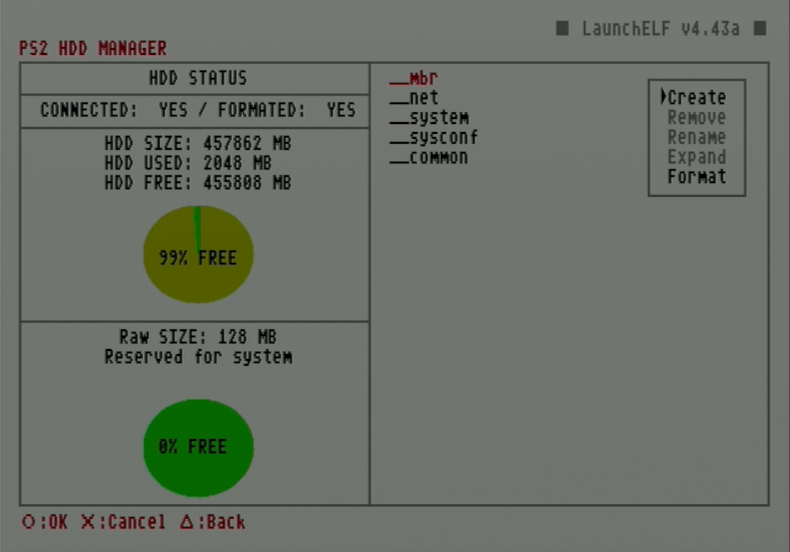

# Format and create partitions on hard drive

This guide will cover how to format and partition a hard drive for usage as an internal drive in a PS2. Both of these steps can be done directly on the PS2 using uLaunchELF/wLaunchELF (loaded from a FreeMcBoot card) to run `HddManager`.

!!! warning "Flashing pre-made images to hard drive"

    An alternative to using uLaunchELF to format the drive is to flash a pre-made RAW image typically to install FreeHDBoot or packaged programs using HDD Raw Copy Tool. These disc images are created from drives that may have differing disk geometry from the one you are using, so it is recommended to instead use uLaunchELF to format and create needed partitions.

!!! warning "Formatting with WinHIIP"

    Another alternative to formatting the drive with uLaunchELF is to use WinHIIP. WinHIIP is no longer recommended because it is obsolete, has remaining bugs, and struggles to format drives as large as 2TB.

## Credits

- This guide follows [Blaine Locklair's YouTube tutorial](https://www.youtube.com/watch?v=C02j3wTuJag)

## Requirements

* Internal hard drive
* FMCB memory card

## Instructions

1. Attach the hard drive to the SATA or IDE connection on the network adapter and plug into the PS2.
1. Plug the FMCB card into the memory card slot.
1. Boot up the PS2.
1. Launch `uLaunchELF` from the main menu.

    <figure markdown="span">
      { width="500" }
    </figure>

1. In this menu, circle advances and triangle goes back. Press circle to advance to the `FileBrowser`.

    <figure markdown="span">
      { width="500" }
    </figure>

1. Use d-pad to navigate to `MISC/` and press circle to select it.

    <figure markdown="span">
      { width="500" }
    </figure>

1. Navigate to `HddManager` and press circle to select it.

    <figure markdown="span">
      { width="500" }
    </figure>

1. The PS2 HDD Manager screen should show the HDD as connected but not formatted. Press R1 to access the menu.

    <figure markdown="span">
      { width="500" }
    </figure>

1. When the small menu pops up on the right, scroll down and select `Format`.

    <figure markdown="span">
      { width="500" }
    </figure>

1. Press circle to select `OK` on the popup.

    <figure markdown="span">
      { width="500" }
    </figure>

1. Once the format is completed, the partition status of the drive will be displayed. In this next step, we will create a partition specifically for OPL data such as artwork and themes. Press R1 to access the `MENU`.

    <figure markdown="span">
      { width="500" }
    </figure>

12. Press circle to select the `Create` option.

    <figure markdown="span">
      { width="500" }
    </figure>

13. Set the name of this partition to `+OPL` then select `OK` .

    <figure markdown="span">
      { width="500" }
    </figure>

14. Set the partition size for the OPL app data.

    !!! warning "Expanding the +OPL partition size"

        While the HddManager has the option to expand existing partitions, this has the potential to corrupt the partition. In case the +OPL partition needs to be expanded later, [a batch tool workaround exists](https://www.psx-place.com/threads/wlaunchelf-hddmanager-partition-expanding-test.35704/#post-315273).

    <figure markdown="span">
      { width="500" }
    </figure>

15. Press circle to select `OK`.

    <figure markdown="span">
      { width="500" }
    </figure>

16. Once finished, it will show the created partition. Press triangle to `Exit`.

    <figure markdown="span">
      { width="500" }
    </figure>

!!! warning "Removing an internal hard drive"

    Always ensure the PS2 is properly powered off before removing the internal hard drive.

Once the hard drive has been formatted, game backups can be installed onto it and played through OPL.

!!! tip "Tip: Create OPL folders"

    Before removing the hard drive from the PS2, launch OPL to generate the appropriate subdirectories. This can save time if you plan to load game artwork or OPL themes later.

[**Next: Install game backups to hard drive**](../hdl-batch-installer/) 