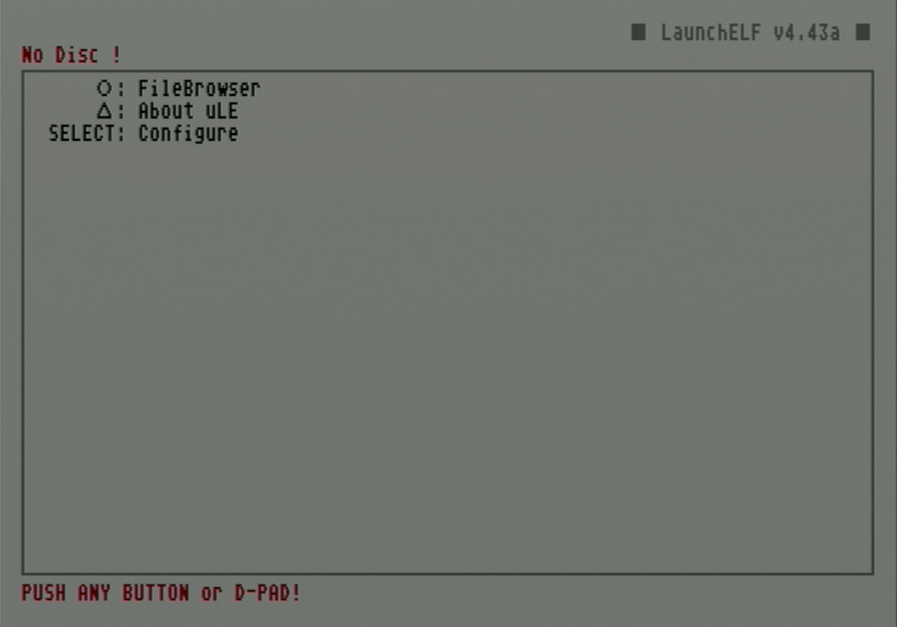
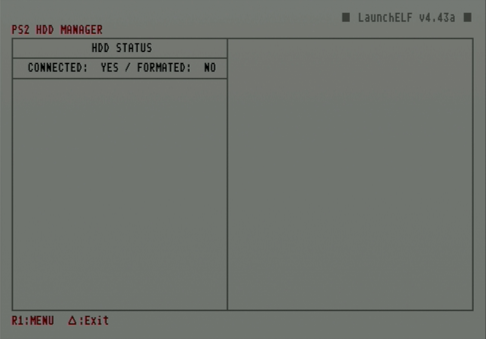
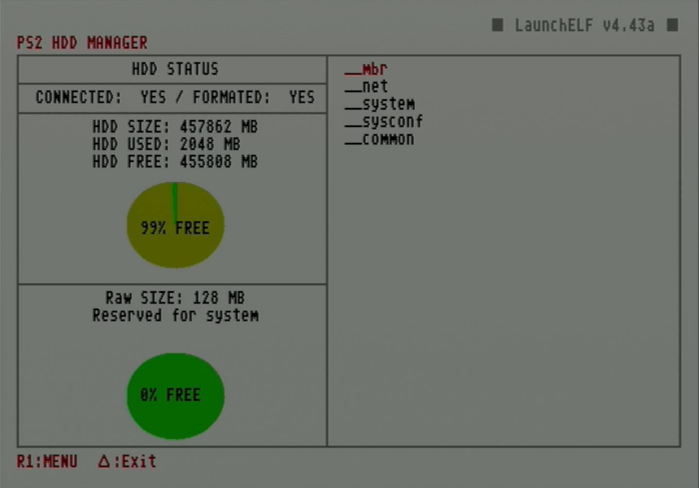
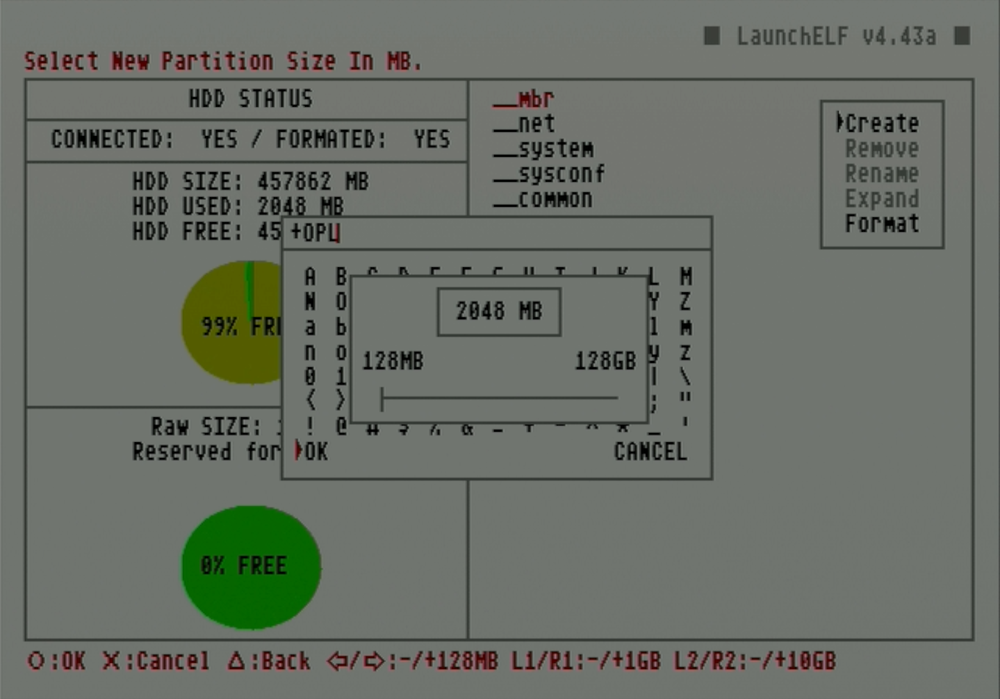
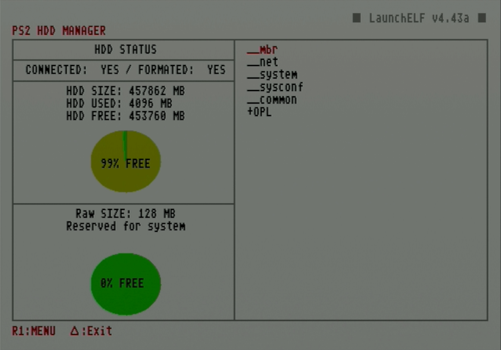

# Format and create partitions on hard drive using uLaunchELF on PS2

Before being used in a compatible PS2, a hard drive must be formatted. Partitioning allows it to set aside storage for specific apps, such as OPL. Both of these steps can be done directly on the PS2 using uLaunchELF/wLaunchELF to run `HddManager`.

!!! warning "Flashing pre-made images to hard drive"

    An alternative to using uLaunchELF to format the drive is to flash a pre-made RAW image typically to install FreeHDBoot or packaged programs using HDD Raw Copy Tool. These disc images are created from drives that may have differing disk geometry from the one you are using, so it is recommended to instead use uLaunchELF on your PS2 format it and create needed partitions.

!!! warning "Formatting and repairing with WinHIIP"

    Another alternative to formatting the drive with uLaunchELF is to use WinHIIP. WinHIIP is no longer recommended because it is obsolete, has remaining bugs, and struggles to format drives as large as 2TB.

## Credits

- This guide follows [Blaine Locklair's YouTube tutorial](https://www.youtube.com/watch?v=C02j3wTuJag)

## Requirements

* Internal hard drive
* FMCB memory card

## Instructions

1. Attach the hard drive to the SATA or IDE connection on the network adapter and plug into the PS2.
2. Plug the FMCB card into the memory card slot.
3. Boot up the PS2.
4. Launch `uLaunchELF` from the main menu.

    

5. In this menu, circle advances and triangle goes back. Press circle to advance to the `FileBrowser`.

    

6. Use d-pad to navigate to `MISC/` and press circle to select it.

    

7. Navigate to `HddManager` and press circle to select it.

    

8. The PS2 HDD Manager screen should show the HDD as connected but not formatted. Press R1 to access the menu.

    

9. When the small menu pops up on the right, scroll down and select `Format`.

    

10. Press circle to select `OK` on the popup.

    

11. Once the format is completed, the partition status of the drive will be displayed. Press R1 to access the `MENU`.

    

12. Press circle to select the `Create` option.

    

13. Set the name of this partition to `+OPL` then select `OK` .

    

14. Set the partition size.

    !!! warning "+OPL partition size"

        While the HddManager has the option to expand existing partitions, this has the potential to corrupt the partition. In case the +OPL partition needs to be expanded later, [a batch tool workaround exists](https://www.psx-place.com/threads/wlaunchelf-hddmanager-partition-expanding-test.35704/#post-315273).

    

15. Press circle to select `OK`.

    

16. Once finished, it will show the created partition. Press triangle to `Exit`.

    
