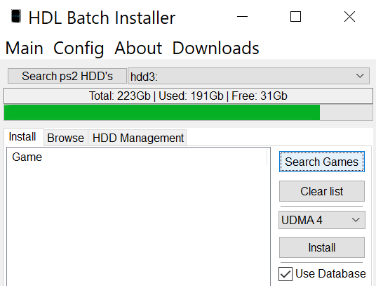

# Install game backups to hard drive using HDL Batch Installer

This guide will walk through loading game backups directly onto the hard drive from a PC using HDL Batch Installer.

!!! warning "Removing games"

    Because PS2 games are installed as separate partitions, uninstalling them is more complex than just deleting a single file. A separate guide for how to delete games by deleting their partitions [can be found here](../uninstall-OPL-games/).

## Requirements

* Internal hard drive formatted for PS2
* [HDL Batch Installer](https://www.psx-place.com/resources/hdl-batch-installer.1173/)

!!! warning "Hard drive format"

    Your hard drive MUST be formatted properly for PS2 usage before following these steps. If you have not formatted your drive yet, follow [this guide](../create-drive-partitions/) first.

## Instructions

1. Connect your hard drive to your PC using a SATA enclosure or adapter.

2. Download and unzip the [HDL Batch Installer](https://www.psx-place.com/resources/hdl-batch-installer.1173/).

3. Right click `HDL-Batch-installer.exe` and select `Run as administrator`. Select `OK`.

1. Click `search ps2 HDD's` at the top of the program. It will automatically populate with a connected PS2 hard drive.

    <figure markdown="span">
      { width="400" }
    </figure>

1. Click the `Search Games` button on the right.

    <figure markdown="span">
      { width="400" }
    </figure>

1. In the file dialog, select the games to add and press `Open`. If successful, the games will be properly staged in a list under `Game`.

    <figure markdown="span">
      { width="400" }
    </figure>

1. Click `Install`. A popup will show the progress and it will disappear when done.

    <figure markdown="span">
      { width="400" }
    </figure>

Now that the games have been installed, the hard drive can be inserted back into the PS2 and loaded in OPL. However, note that games will not display artwork by default in OPL. If you would like to add artwork for the game menu displays in OPL, follow the next guide.

[**Next (Optional): Add artwork to OPL**](../add-artwork-to-opl/)