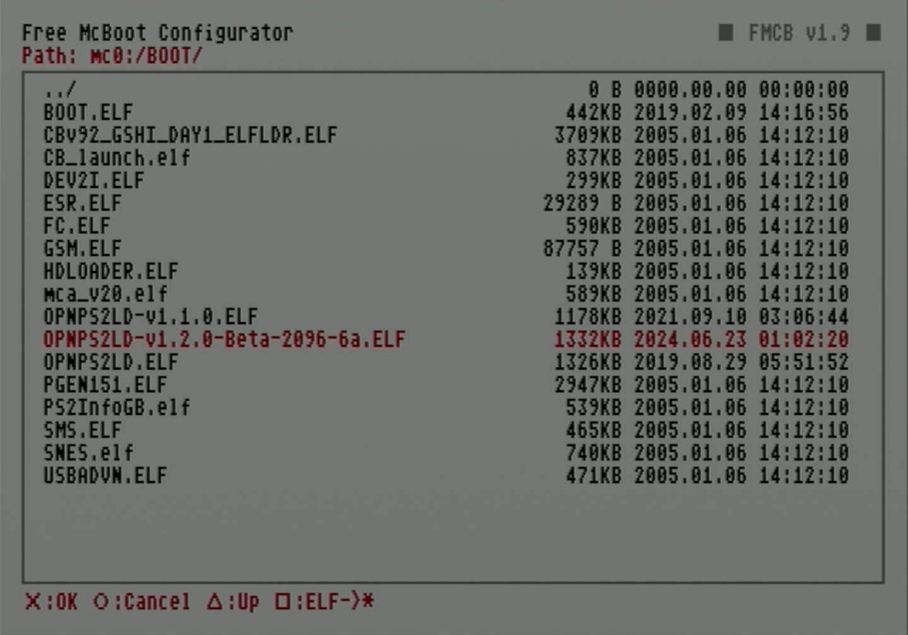

# Install or Update OPL

OPL is typically already installed on a pre-made FMCB memory card. However, if it is not yet installed, this guide will walk you through the process.

!!! note "Updating OPL"

    These steps can also be used to update OPL. If your OPL elf files have the same name, you can simply overwrite the existing OPL elf. However, if your new OPL elf has a different file name (because of versioning), you can choose to install it in addition to the previous one or delete the other OPL elf after installing the new one.

!!! tip "Tip: Installing apps"

    These instructions can also be used to install other homebrew apps as well. You can find other apps to install on [PSX Place](https://www.psx-place.com/resources/categories/playstation-2-ps2.7/) or [Internet Archive](https://archive.org/details/ps2-homebrew-library).

## Credits

- This guide transcribes [How To Install OPL v0.9.4 Onto Any PS2! (Open PS2 Loader) 2018!](https://www.youtube.com/watch?v=16LZNZ442ew)

## Requirements

* FMCB memory card
* USB thumb drive

## Instructions

### Load OPL elf file onto USB

1. Go to the [OPL Github](https://github.com/ps2homebrew/Open-PS2-Loader/releases) page and select the version you want to use.

    1. The most recent stable release will be given a version name such as v1.1.0 and will be labeled `Latest`. This will provide the best stability, but may not have improvements made in beta releases.
    
    1. The beta release will be named "latest" (with the `Pre-release` tag) and will have any ongoing improvements but may have less stability.

1. On the version page you want to use, scroll down to the **Assets** heading and download `OPNPS2LD.7z`.

    <figure markdown="span">
      { width="400" }
    </figure>

1. Unzip the file. Insert your USB drive into your PC and copy `OPNPS2LD.ELF` or `OPNPS2LD-[version number].ELF` (depending on which version you are using) to it.

    <figure markdown="span">
      { width="400" }
    </figure>

1. Eject the USB thumb drive from your PC.

### Copy the OPL elf onto FMCB card

1. Insert both your the USB thumb drive with the OPL elf and FMCB memory card into the PS2 and boot it up.

1. From the home screen launch `uLaunchELF`.

    <figure markdown="span">
      { width="500" }
    </figure>

1. Press circle to enter the file browser.

    <figure markdown="span">
      { width="500" }
    </figure>

1. Scroll down and select `mass:/`.

    <figure markdown="span">
      { width="500" }
    </figure>

1. Find the OPL elf file on your USB thumb drive and highlight it. Press R1 to open the menu.

    <figure markdown="span">
      { width="500" }
    </figure>

1. Press circle to select `Copy`.

    <figure markdown="span">
      { width="500" }
    </figure>

1. It will confirm by showing red status text in the upper left corner reading `Copied to the Clipboard`.

    <figure markdown="span">
      { width="500" }
    </figure>

1. Press triangle to return through directories until you are at the top level again. From here, select `mc0:/` if your FMCB card is inserted in the first slot, or `mc1:/` if it is in the second.

    <figure markdown="span">
      { width="500" }
    </figure>

1. Scroll down and select the `BOOT/` folder.

    <figure markdown="span">
      { width="500" }
    </figure>

1. In this folder, press R1 to pull up the menu.

    <figure markdown="span">
      { width="500" }
    </figure>

1. Press circle to select `Paste`.

    1. If you are updating OPL, you may be prompted to override an existing OPL elf. In the dialog window, confirm that you would like to overwrite the previous OPL elf.

    <figure markdown="span">
      { width="500" }
    </figure>

1. A dialog will pop up showing the file copying progress.

    <figure markdown="span">
      { width="500" }
    </figure>

1. When complete, your OPL elf will display in the list.

    <figure markdown="span">
      { width="500" }
    </figure>

### Add OPL to the home menu

1. Restart your PS2.

1. Select `Free McBoot Configurator` from the home screen.

    <figure markdown="span">
      { width="500" }
    </figure>

1. Select your preferred button layout.

    <figure markdown="span">
      { width="500" }
    </figure>

1. In the next menu, scroll down to select `Configure OSDYS options...`

    <figure markdown="span">
      { width="500" }
    </figure>

1. Tap one down to highlight `Configure Item 1:`. This will highlight the first home menu item.

    <figure markdown="span">
      { width="500" }
    </figure>

1. Pressing left and right on the d-pad will scroll through the home menu options. Continue pressing right until the item field is empty and select it. This is where we will install OPL.

    <figure markdown="span">
      { width="500" }
    </figure>

1. On the edit entry screen, select `Name:`.

    <figure markdown="span">
      { width="500" }
    </figure>

1. Enter a descriptive name such as `OPL`, `OpenPS2Loader`, or `OPL [version]`. Hit `OK`.

    <figure markdown="span">
      { width="500" }
    </figure>

1. Tab down one entry and select `Path1:`.

    <figure markdown="span">
      { width="500" }
    </figure>

1. From here, we will find the newly pasted OPL elf on our FMCB memory card. Select the memory card you are using, `mc0:/` if first slot or `mc1:/` if second.

    <figure markdown="span">
      { width="500" }
    </figure>

1. Scroll down to `BOOT/` and select it.

    <figure markdown="span">
      { width="500" }
    </figure>

1. Scroll down to the OPL elf and select it.

    <figure markdown="span">
      { width="500" }
    </figure>

1. The elf path will now populate the `Path1` field. Scroll down and select `Return`.

    <figure markdown="span">
      { width="500" }
    </figure>

1. The home menu entry will now populate the OPL name you entered. Scroll down and select `Return`.

    <figure markdown="span">
      { width="500" }
    </figure>

1. Finally, we will save the FMCB config file with our new menu changes. Select `Save CNF to MC0` for a FMCB card in the first slot and `MC1` for the second.

    <figure markdown="span">
      { width="500" }
    </figure>

1. It will display `Saved [config file path]` when finished. Back out to the home menu by scrolling down and selecting `Exit` (then backing out of the memory card view by pressing circle) or restarting your PS2.

    <figure markdown="span">
      { width="500" }
    </figure>

1. OPL will now be installed on your FMCB card and accessible from your home menu.

    <figure markdown="span">
      { width="500" }
    </figure>

Once OPL is installed, you can continue to loading game backups onto your formatted hard drive.

If your drive is formatted:

[**Next: Install game backups to hard drive**](../hdl-batch-installer/)

If your drive has yet to be formatted:

[**Next: Format and partition hard drive**](../create-drive-partitions/) 