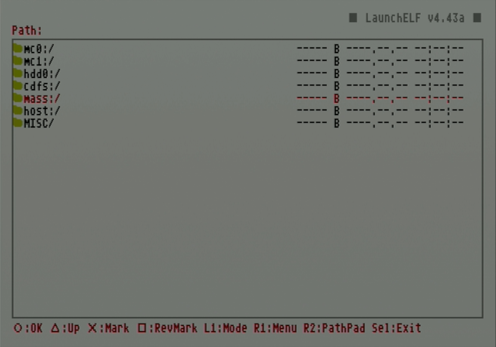
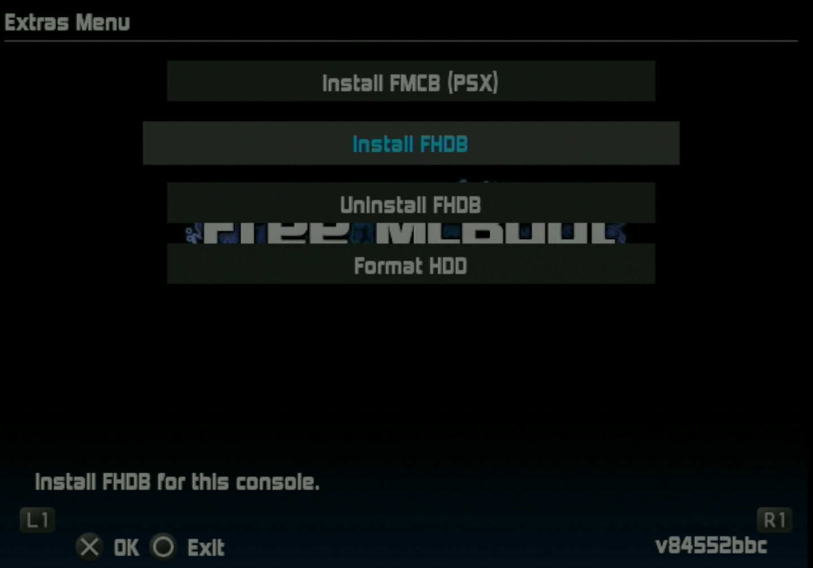

# Install FreeHDBoot to internal hard drive

Instead of loading FreeMcBoot from a memory card, it is possible to load it directly from the hard drive by installing FreeHDBoot. This guide will walk through installing FreeHDBoot onto your internal hard drive using an existing FMCB card and USB thumb drive.

!!! warning "Flashing pre-made images to hard drive"

    An alternative to installing FreeHDBoot using a FreeMcBoot card is to flash a pre-made RAW image using HDD Raw Copy Tool. These disc images are created from drives that may have differing disk geometry from the one you are using, so it is recommended to instead use uLaunchELF to run the FreeHDBoot installer on your PS2 to install it to your hard drive instead.

## Credits

- This guide transcribes and takes screenshots from [
Blaine Locklair
's YouTube tutorial](https://www.youtube.com/watch?v=C02j3wTuJag)

## Requirements

* Internal hard drive
* USB thumb drive formatted to FAT32
* FMCB memory card

## Instructions

1. Download the [FreeMcBoot installer](https://israpps.github.io/FreeMcBoot-Installer/test/8_Downloads.html) by clicking the latest version.
1. Plug USB thumb drive into PC.
1. If the thumb drive is not formatted to FAT32, use **GUIFormat** to format it.
1. Copy the unzipped installer folder onto the thumb drive.

    <figure markdown="span">
      { width="400" }
    </figure>

1. Insert the thumb drive, FMCB card, and hard drive into the PS2.

    !!! warning "The hard drive must be formatted"

        If the hard drive has not been formatted yet, follow the [formatting tutorial here](create-drive-partitions.md).

2. Boot up the PS2 and select `uLaunchELF`.

    <figure markdown="span">
      { width="500" }
    </figure>

1. Press circle to enter the `FileBrowser`.

    <figure markdown="span">
      { width="500" }
    </figure>

1. Scroll down to `mass:/` which represents the USB thumb drive and press circle to select.

    <figure markdown="span">
      { width="500" }
    </figure>

1. Scroll down to highlight the extracted installer folder and press circle.

    <figure markdown="span">
      { width="500" }
    </figure>

1. Scroll down to `FMCBInstaller.elf` and press circle.

    <figure markdown="span">
      { width="500" }
    </figure>

1. The Free McBoot installer will launch. Note on these menus X is OK and circle is exit. Navigate the various menus using L1 or R1. Press R1 to view the `Extras Menu`.

    <figure markdown="span">
      { width="500" }
    </figure>

1. Scroll to `Install FHDB` and press X to select.

    <figure markdown="span">
      { width="500" }
    </figure>

1. Select `Yes`.

    <figure markdown="span">
      { width="500" }
    <figcaption>Img credit: Blaine Locklair</figcaption>
    </figure>

1. When the installation finished, it will show this dialog. Hit `OK`.

    <figure markdown="span">
      { width="500" }
    <figcaption>Img credit: Blaine Locklair</figcaption>
    </figure>

1. The FreeHDBoot install is finished! The next time the PS2 is booted it does not need the FMCB card inserted.