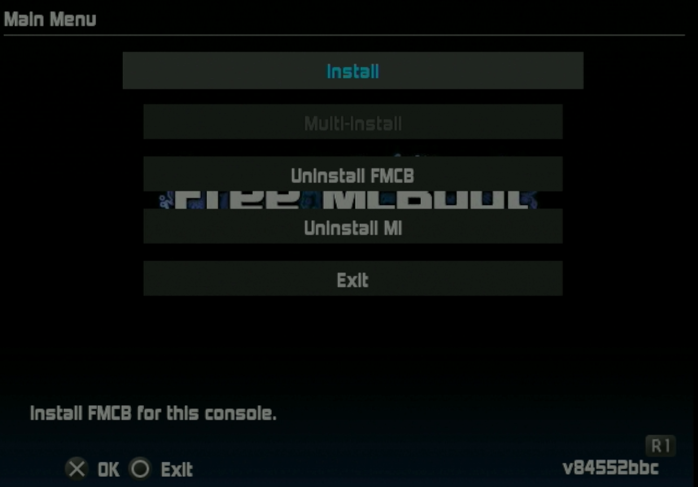

# Install FreeHDBoot to internal hard drive

!!! warning "Flashing pre-made images to hard drive"

    An alternative to installing FreeHDBoot using a FreeMcBoot card is to flash a pre-made RAW image using HDD Raw Copy Tool. These disc images are created from drives that may have differing disk geometry from the one you are using, so it is recommended to instead use uLaunchELF to run the FreeMcBoot installer on your PS2 to install it to your hard drive instead.

## Credits

- This guide transcribes [
Blaine Locklair
's YouTube tutorial](https://www.youtube.com/watch?v=C02j3wTuJag)

## Requirements

* Internal hard drive
* USB thumb drive formatted to FAT32
* FMCB memory card

## Instructions

1. Download the [FreeMcBoot installer](https://israpps.github.io/FreeMcBoot-Installer/test/8_Downloads.html) by clicking ver 1.966.
2. Plug USB thumb drive into PC.
3. If the thumb drive is not formatted to FAT32, use **GUIFormat** to format it.
4. Copy the unzipped installer folder onto the thumb drive.

    

1. Insert the thumb drive, FMCB card, and hard drive into the PS2.

    !!! warning "The hard drive must be formatted"

        If the hard drive has not been formatted yet, follow the [formatting tutorial here](create-drive-partitions.md).

2. Boot up the PS2 and select `uLaunchELF`.

    

1. Press circle to enter the `FileBrowser`.

    

1. Scroll down to `mass:/` which represents the USB thumb drive and press circle to select.

    

1. Scroll down to highlight the extracted installer folder and press circle.

    

1. Scroll down to `FMCBInstaller.elf` and press circle.

    

1. The Free McBoot installer will launch. Note on these menus X is OK and circle is exit. Navigate the various menus using L1 or R1. Press R1 to view the `Extras Menu`.

    

1. Scroll to `Install FHDB` and press X to select.

    

1. Select `Yes`.

    

1. When the installation finished, it will show this dialog. Hit `OK`.

    

1. The FreeHDBoot install is finished! The next time the PS2 is booted it does not need the FMCB card inserted.
