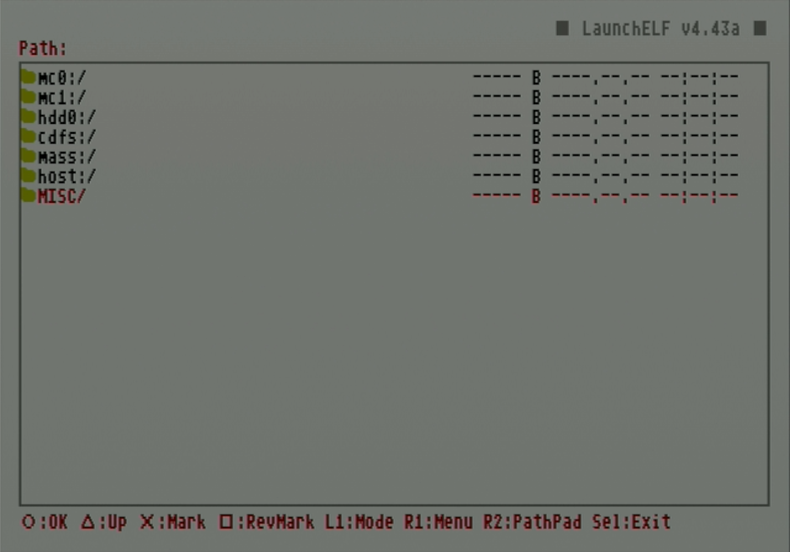

# Uninstall OPL games

Because the Playstation File System installs PS2 games as separate partitions, uninstalling them is more complex than just deleting a single file. This guide will give instructions for how to delete games by deleting their partitions using the HddManager in uLaunchELF/wLaunchELF.

!!! warning "Deleting games within OPL"

    While OPL displays the option to delete games with the `Write Operations` setting enabled, this action will not fully remove the game partition from the HDD and may leave "phantom" game entries in the OPL game list.

## Requirements

* FMCB card
    * If FreeHDBoot is already installed, ignore FMCB card instructions
* Internal hard drive

## Instructions

1. Ensure the FMCB card and internal hard drive are connected to your PS2 and boot it up.

1. Launch `uLaunchELF`/`wLaunchELF` from the home menu.

    <figure markdown="span">
      { width="500" }
    </figure>

1. Press circle to select the `FileBrowser`.

    <figure markdown="span">
      { width="500" }
    </figure>

1. Use d-pad to navigate to `MISC/` and press circle to select it.

    <figure markdown="span">
      { width="500" }
    </figure>

1. Navigate to `HddManager` and press circle to select it.

    <figure markdown="span">
      { width="500" }
    </figure>

1. This page will show the status of the internal hard drive, including a space visualization and partition list. Under **OPL+**, you will see a list of the installed games as separate partitions. From here tab down to find the game you want to delete.

    <figure markdown="span">
      { width="500" }
    </figure>

1. When the game is highlighted, press R1 to open the menu.

    <figure markdown="span">
      { width="500" }
    </figure>

1. Tab down and select the `Remove` option.

    <figure markdown="span">
      { width="500" }
    </figure>

  1. Select `OK`.

    <figure markdown="span">
      { width="500" }
    </figure>

  1. The status text will confirm that the partition has been removed, and it will be removed from the OPL game list.

    <figure markdown="span">
      { width="500" }
    </figure>

